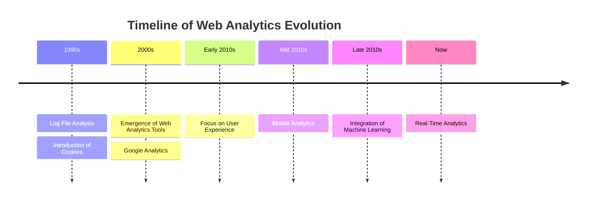

# Evolution of Web Analytics
{: .no_toc }

The history of web analytics reflects the ongoing evolution of technology, user behavior, and the need for businesses to derive meaningful insights from online interactions. As the digital landscape continues to evolve, so too will the tools and methodologies of web analytics.

## 1990s

### Log File Analysis (early 1990s)

In the early days of the World Wide Web, web servers began generating log files that recorded basic information about website visitors, such as IP addresses and accessed resources. Analyzing these log files marked the inception of web analytics.

### Introduction of Cookies (late 1990s)

With the advent of cookies, website owners gained the ability to track user sessions and gather more detailed information about user behavior, such as the pages visited and time spent on the site.

## 2000s

### Emergence of Web Analytics Tools (early 2000s)

Dedicated web analytics tools started to emerge, offering more sophisticated tracking capabilities. Products like Urchin (acquired by Google and later evolved into Google Analytics) and WebTrends gained popularity.

### Google Analytics (mid 2000s)

Google Analytics, launched in 2005, marked a significant milestone. It provided a free, accessible, and feature-rich platform for website owners to analyze visitor behavior, track marketing efforts, and gain insights into website performance.

## 2010s

### Focus on User Experience (late 2000s to early 2010s)

The evolution of web analytics shifted towards a user-centric approach. Metrics like bounce rate, time on page, and user flow analysis gained prominence as website owners sought to understand and improve the user experience.

### Mobile Analytics (mid 2010s)

With the surge in mobile device usage, web analytics tools began to prioritize mobile analytics. The ability to track and analyze user interactions on mobile websites and apps became essential.

### Integration of Machine Learning (late 2010s)

Web analytics tools started integrating machine learning and artificial intelligence for more advanced insights. Predictive analytics and automated recommendations became valuable features.

## Present Day

### Real-Time Analytics

The demand for real-time data analysis has grown. Modern web analytics tools provide real-time reporting, allowing businesses to react promptly to changing trends and user behavior.
