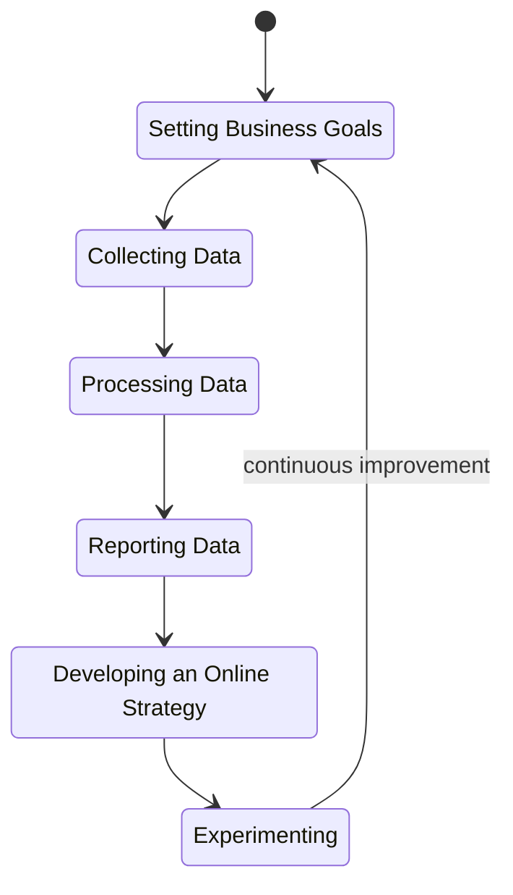

# What is Web Analytics?
{: .no_toc }

Web analytics is the process of **collecting**, **measuring**, **analyzing**, and **reporting** data related to user interactions with a website.

The goal is to understand and optimize web usage, providing valuable insights that inform strategic decision-making. Through the examination of user behavior, preferences, and performance metrics, web analytics empowers businesses to enhance their online presence, user experience, and overall digital strategy.

## Overall Approach

